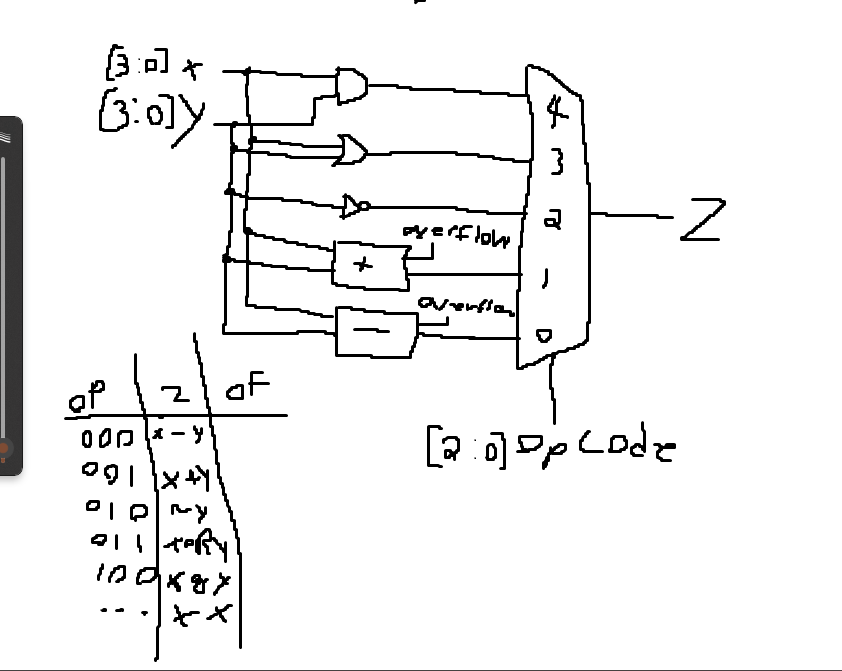

# 4-bit Arithmetic Logic Unit (ALU) in Vivado

This project implements a 4-bit Arithmetic Logic Unit (ALU) using Verilog in Vivado. The ALU supports five operations: unsigned addition, unsigned subtraction, bitwise NOT (for the B input), bitwise OR, and bitwise AND operations.

## Sketch

## Features

- **Operations Supported:**
  - Unsigned Addition (`A + B`)
  - Unsigned Subtraction (`A - B`)
  - Bitwise NOT (`~B`)
  - Bitwise OR (`A | B`)
  - Bitwise AND (`A & B`)

- **Inputs and Outputs:**
  - **Inputs:** A (4-bit), B (4-bit), Operation Select (OpCode) (3-bit)
  - **Outputs:** Result (r) (4-bit), Overflow Flag (OVFlag) (1-bit)

- **Overflow Handling:** 
  - The ALU sets an overflow flag when the result of an addition or subtraction operation exceeds the 4-bit limit.

## Simulation

   - Simulate the ALU functionality using the provided `ALU_TOP_tb`.
   - Change the testbench to test different stimuli and verify the ALU's functionality.
     
### Example Scenarios Tested

  1. Basic Operations:
       - Verify each OpCode to ensure correct functionality using values 8 (A) and 7 (B).
  3. Overflow Handling:
       - Test addition and subtraction overflow scenarios with values 10 (A) and 12 (B).
       - Check the overflow flag to ensure correct detection and handling.

## Future Improvements

- Extend the ALU to support signed arithmetic operations.
- Extend it to a 32-bit ALU.
- Add more operations like Multiplication, Shift, XOR, etc.

## License

This project is licensed under the GNU GPL v3 - see the [LICENSE](LICENSE) file for details.
